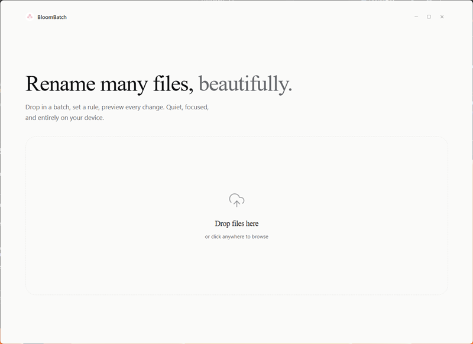
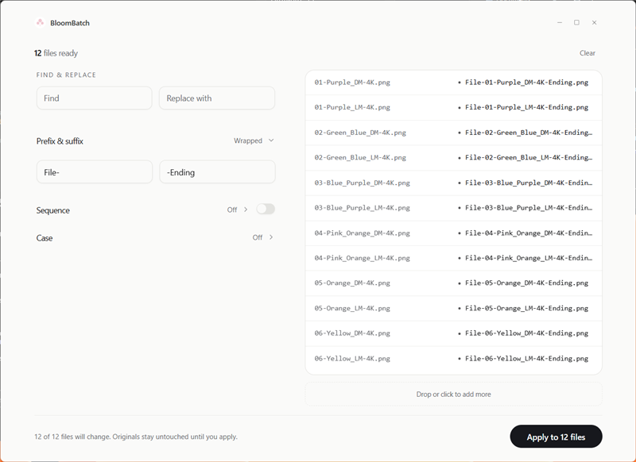
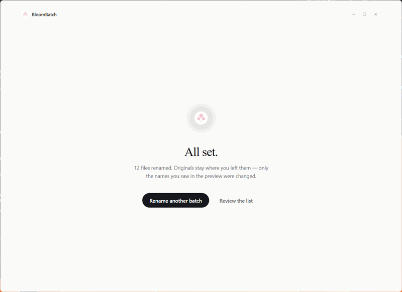

<p align="center">
  
</p>
<h1 align="center">BloomBatch</h1>
<p align="center">Batch rename files locally with live preview, partial-success reporting, and a frameless desktop shell.</p>
<p align="center">
  <a href="https://tauri.app"></a>
  <a href="https://nextjs.org"></a>
  <a href="https://www.typescriptlang.org"></a>
  <a href="https://www.rust-lang.org"></a>
  <a href="LICENSE"></a>
</p>

## Table of Contents
- [What it does](#what-it-does)
- [Features](#features)
- [Screenshots](#screenshots)
- [Quick Start](#quick-start)
- [Install and Run](#install-and-run)
- [Architecture](#architecture)
- [Tech Stack](#tech-stack)
- [Contributing](#contributing)
- [License](#license)

## What it does
BloomBatch is a local-first desktop app for batch renaming files. You drop in files, define a rename rule, preview the result before anything changes, and apply the rename from the same window.

The app is intentionally narrow:
- It renames files, not folders.
- It runs locally through Tauri and Rust.
- It does not require an account, sync service, or database.

## Features
- Drag and drop files onto the app window.
- Open files through the native file picker when you prefer that flow.
- Preview original and renamed filenames side by side before applying changes.
- Find and replace text across filenames.
- Add prefixes and suffixes.
- Add sequential numbering with configurable start value, padding, separator, and position.
- Convert names to lowercase, uppercase, or title case.
- Keep going when one rename fails, with per-file partial-success reporting.
- Use the frameless desktop shell with native minimize, maximize, and close controls.

## Screenshots

| Overview | Preview | Success |
|---|---|---|
|  |  |  |

## Quick Start
```bash
npm ci
npm run tauri:dev
```

For a frontend-only check in the browser:
```bash
npm run dev
```

For a production build:
```bash
npm run build
npm run tauri:build
```

## Install and Run

### Requirements
- Node.js 20 or newer
- Rust stable toolchain
- Platform-specific WebView / system libraries listed in [BUILD.md](BUILD.md)

### Development
```bash
npm ci
npm run tauri:dev
```

`tauri:dev` starts the Next.js frontend, launches the desktop window, and keeps both layers hot-reloaded while you work.

### Production builds
```bash
npm run build
npm run tauri:build
```

`npm run build` creates the static frontend export in `out/`. `npm run tauri:build` packages that export with the Rust backend into native installers and app bundles for the current platform.

### Platform output
- Windows: `.msi` and `.exe`
- macOS: `.dmg` and `.app`
- Linux: `.AppImage`, `.deb`, and `.rpm`

## Architecture
BloomBatch is a Tauri 2 desktop app with a small and direct split:

- `app/` holds the Next.js app shell and metadata.
- `components/bloom-batch/` holds the desktop UI flow and rename experience.
- `components/bloom-batch/rename.ts` contains the pure rename rules and preview logic.
- `lib/tauri-bridge.ts` wraps the Tauri IPC calls behind browser-safe helpers.
- `src-tauri/src/commands.rs` performs the native file operations.

The frontend renders a preview first, then calls into Rust only when the user applies the rename. That keeps the UI responsive and keeps file access bounded to explicit user actions.

See [docs/architecture.md](docs/architecture.md) for a fuller breakdown.

## Tech Stack
- Next.js 16
- React 19
- Tauri 2
- Rust 2021
- TypeScript 5.7
- Tailwind CSS 4
- shadcn/ui
- Radix UI

## Contributing
Read [CONTRIBUTING.md](CONTRIBUTING.md) before opening a pull request.

## License
BloomBatch is distributed under the [MIT License](LICENSE).
