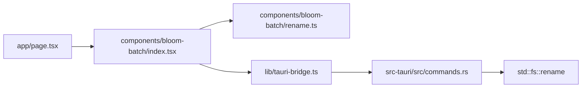

# Architecture

BloomBatch is a small Tauri 2 desktop app with one clear job: rename files safely, locally, and with a live preview.

## Overview

## Runtime layers

### Next.js shell
- `app/layout.tsx` defines the root metadata and global shell.
- `app/page.tsx` renders the BloomBatch app into the window.
- `app/globals.css` defines the shared design tokens and base theme.

### Desktop UI
- `components/bloom-batch/index.tsx` coordinates the screen states, file list, and rename flow.
- `components/bloom-batch/drop-zone.tsx` handles native dialog selection and drag and drop.
- `components/bloom-batch/rule-controls.tsx` edits rename rules.
- `components/bloom-batch/preview-list.tsx` shows the live preview and collisions.
- `components/bloom-batch/success-screen.tsx` confirms the result after a successful rename pass.

### Pure rename logic
- `components/bloom-batch/rename.ts` is intentionally free of React and Tauri code.
- It converts the current rules and file names into preview results.
- That separation keeps the preview logic testable without the desktop shell.

### Tauri bridge
- `lib/tauri-bridge.ts` is the only browser-facing wrapper around Tauri APIs.
- It uses dynamic imports so the module can still load in the browser.
- The bridge keeps the React side agnostic about the runtime environment.

### Rust backend
- `src-tauri/src/commands.rs` handles the file picker and the actual rename operation.
- The rename command returns partial success instead of failing the whole batch on one error.
- File system access stays bounded to user-selected files.

## Build flow

`src-tauri/tauri.conf.json` wires the build together:
- `npm run dev` starts the Next.js dev server.
- `npm run build` creates the static frontend export in `out/`.
- `npm run tauri:build` bundles that export with the Rust backend.

## Design boundaries

- The frontend owns preview state and user interaction.
- Rust owns file system mutation.
- No database, remote API, or background sync layer exists in the shipped app.

## Why this shape

This structure keeps the app simple to reason about:
- The rename preview is pure data transformation.
- The native side only runs when the user applies a rename.
- The browser side stays usable even without Tauri, which makes development and documentation easier.
